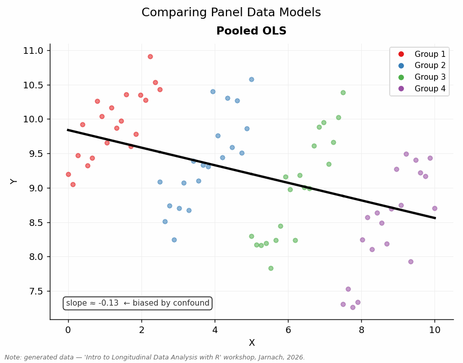

# Introduction {.unnumbered}

This workshop material accompanies a one-day [Grand Union DTP](https://www.granduniondtp.ac.uk) workshop Longitudinal Data Analysis, taught by [Dr Clemens Jarnach](https://clemensjarnach.github.io) at the University of Oxford.

::: {.callout-note collapse="true"}
## 2026 DTP Longitudinal Data Analysis Workshop — Syllabus (PDF)

[2026 DTP Longitudinal Data Analysis Workshop — Syllabus (PDF)](files/longitudinal_data_analysis_workshop)
:::


## Why use panel data analysis?

Much of empirical social science is driven by causal questions: we want to know not just whether two things are related, but whether one actually brings about the other. Using purely cross-sectional data, we can compare different units — people, firms, countries — and test whether they differ according to some treatment or variable of interest. But this approach has a well-known limitation: those units may differ in many other respects, and we are unlikely to observe all of them. The result is that we may mistake confounded correlation for causation.

The gold standard for establishing causation is the randomised controlled trial (RCT). By randomly assigning some units to treatment, we ensure that no unobserved characteristics can be systematically correlated with who receives it — treatment and control groups are, on average, identical in all respects except the intervention itself. However, random assignment is often ethically or practically impossible in the social sciences. Consider studying the effects of education, marriage, or childbirth — the ethics committee will not be sympathetic.

Panel data offer a pragmatic middle ground. Rather than comparing different units at a single point in time, we compare the *same unit to itself* across time: a unit before and after some change, in other words "comparing like with like" [@firebaughSevenRulesSocial2008]. Stable, unobserved characteristics — the factors that would otherwise confound our estimates — drop out of the analysis, because they are constant within each unit. This is not as secure as an RCT, but it is far more feasible for most social science research questions and substantially more credible than naive cross-sectional comparisons.

{fig-alt="Animation cycling through Pooled OLS, Fixed Effects, Random Effects, and Mixed Effects regression lines fitted to the same simulated panel dataset with four groups."}

This workshop equips you with the conceptual tools and R skills to work with panel data: to move from describing patterns to making defensible causal claims — or at least to being honest about when you cannot.

## Objectives {.unnumbered}

This workshop introduces the core concepts and methods of longitudinal and panel data analysis using R, equipping participants with the conceptual foundations and practical skills needed to model change over time, address unobserved heterogeneity, and interpret results in a social-scientific context.


## Syllabus {.unnumbered}

- Panel data fundamentals: structure, advantages, common sources, and typical challenges. 
- Introduction to longitudinal modelling: unobserved heterogeneity, within–between variation, and time-varying vs time-invariant predictors.
- Fixed Effects models: assumptions, estimation, interpretation, and extensions.
- Random Effects models: assumptions, estimation, interpretation, and comparisons with FE.
- Exploring longitudinal data in R
- Preparing longitudinal data in R: data reshaping, cleaning, indexing, and handling missingness.
- Model selection and diagnostics: Hausman test, goodness-of-fit considerations, and robustness checks.
- Applied case studies


## Why use R? {.unnumbered}

Throughout this workshop we use **R**, which has become one of the richest environments for longitudinal and panel data analysis. The core packages (e.g., `plm`, `fixest`, `lme4`) support the full analytical pipeline: data import and reshaping, model estimation, post-estimation diagnostics, and publication-quality output. R's broader ecosystem (e.g. `tidyverse`) also makes it straightforward to integrate data preparation and visualisation into your analysis workflow.

All workshop code, data, and exercises use R. If you have not yet installed the required packages, please do so:

``` r
install.packages(c(
  "RColorBrewer", "fixest", "forcats", "haven", "janitor", "lme4",
  "lubridate", "plm", "readxl", "srvyr", "stargazer", "tidyverse", "viridis"
))
```

## Key R Packages {.unnumbered}

R has a rich ecosystem for longitudinal and panel data analysis, spanning data import, reshaping, model estimation, diagnostics, and visualisation. The core packages for this workshop are:

-   **Panel model estimation:** [plm](https://cran.r-project.org/web/packages/plm/index.html) — the standard package for fixed effects, random effects, and pooled OLS on panel data; includes the Hausman test and a wide range of diagnostics

-   **Fast fixed effects:** [fixest](https://cran.r-project.org/web/packages/fixest/index.html) — high-performance estimation of models with multiple high-dimensional fixed effects; syntax is concise and output integrates well with `stargazer` and `modelsummary`

-   **Mixed effects / multilevel models:** [lme4](https://cran.r-project.org/web/packages/lme4/index.html) — fits linear and generalised linear mixed models, useful when random effects structure is substantively motivated

-   **Regression tables:** [stargazer](https://cran.r-project.org/web/packages/stargazer/index.html) — produces publication-ready LaTeX and HTML tables from model objects

-   **Data import:** [haven](https://cran.r-project.org/web/packages/haven/index.html) and [readxl](https://cran.r-project.org/web/packages/readxl/index.html) — read Stata (`.dta`), SPSS (`.sav`), and Excel files directly into R

-   **Data wrangling:** [tidyverse](https://cran.r-project.org/web/packages/tidyverse/index.html) and [janitor](https://cran.r-project.org/web/packages/janitor/index.html) — reshaping between wide and long format, cleaning variable names, and handling missing data

-   **Date and time handling:** [lubridate](https://cran.r-project.org/web/packages/lubridate/index.html) — parsing and arithmetic on date/time variables common in longitudinal datasets

-   **Colour palettes:** [RColorBrewer](https://cran.r-project.org/web/packages/RColorBrewer/index.html) and [viridis](https://cran.r-project.org/web/packages/viridis/index.html) — perceptually uniform and accessible colour scales for visualisation

## Recommended Reading {.unnumbered}

### Core Textbooks

- Croissant, Yves, and Giovanni Millo. 2018. Panel Data Econometrics with R. First edition. Hoboken, NJ: Wiley.

- Angrist, Joshua David, and Jörn-Steffen Pischke. 2008. ‘Mostly Harmless Econometrics : An Empiricist’s Companion’. In Mostly Harmless Econometrics : An Empiricist’s Companion, De gruyter eBooks complete., Princeton, NJ: Princeton University Press.

- Singer, Judith D, and John B Willett. 2003. Applied Longitudinal Data Analysis: Modeling Change and Event Occurrence. 1st edn Oxford u.a: Oxford Univ. Pr.

- Wooldridge, Jeffrey M. 2014. Introduction to Econometrics. Europe, Middle East and Africa edition. Andover.


------------------------------------------------------------------------

### Online Tutorials and Resources

- **Rüttenauer, Tobias.** *Panel Data Analysis.* [https://ruettenauer.github.io/Panel-Data-Analysis/](https://ruettenauer.github.io/Panel-Data-Analysis/ )

## Acknowledgement
This course profited a lot from teaching materials by Tobias Rüttenauer; Jeffrey M.Wooldridge et al., Yves Croissant & Giovanni Millo; and Judith Singer & John Willett. 


